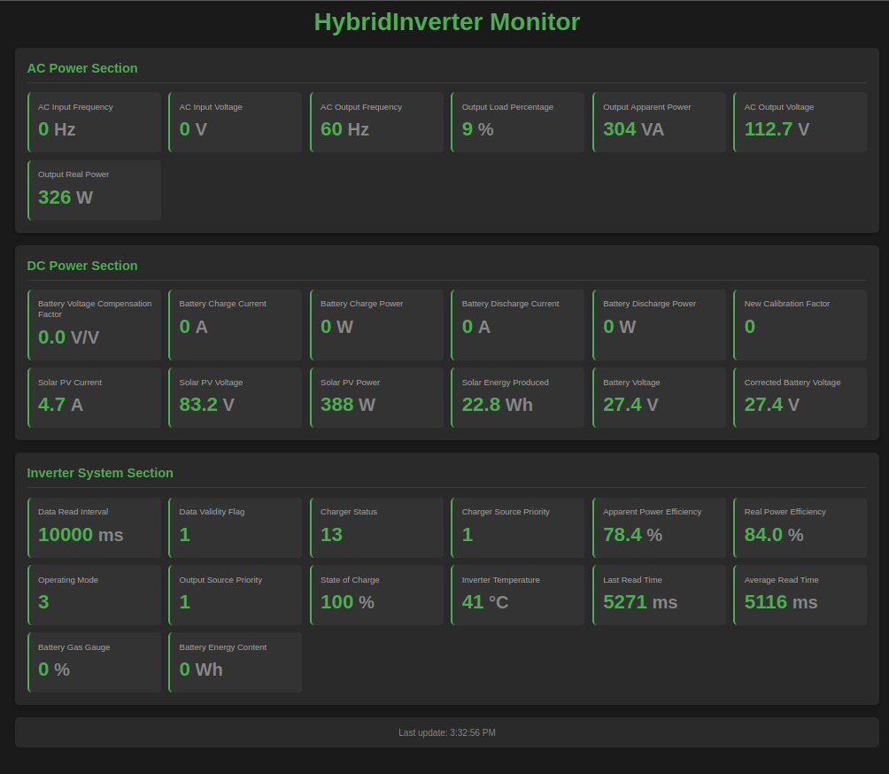

# PowMr POW-LVM3.6M-24V ESP32 based dongle

Based on the work of [Leo Designer](https://github.com/leodesigner/powmr_comm)



## Features

This code will do:
- Connect to your WiFi network (see [WiFi](#wifi) section)
- Make available a `/api/status` json endpoint in json format to consume and use on the index.html page (see [Json](#json) sections)
- A http webserver (sample image on the top of this document) that can be called using hostname.local (see WiFi configuration for details on hostname)
- There is a extra bidge app in python `mqtt_json_2_influx.py` file to run as a service on a linux machine to conecct either to the mqtt server or directly to the ESP32 web and retrieve the json file and push the data to a influxdb server (see [Python Bridge](#python_bridge) section below)

## WiFi

You need to create a file with this content (adjust to your credentials on src/wifi.h):

```cpp
/****** wifi config *******************/
// client wifi settings
const char *c_ssid = "TP-LINK_D3A2D4";
const char *c_password = "175mkHR1yMmFpEuzhCIm81TO";

// server if no client settings
const char *s_ssid = "ESP32-PowMr";
const char *s_password = "f77kh3r8sji24";

// hostname either way
const char *hostname = "ESP32-PowMr";

```

You can see there is a server section, that is a hostpot, if the configured network is not available or got down it will start the hostspot with this credentials, and if the network came back it will re-connect to it, ditching the hostpot.

The default IP on hostpot mode is "192.168.4.1" and there it will register a mDNS http server as 'hostname'.local, aka: `ESP32-PowMr.local` by default.

# Json

The `/api/status` will produce a json like this:

```json
{
	"ac":{
		"input_freq":60.7,
		"input_voltage":122.4,
		"output_freq":60.7,
		"output_load_percent":9,
		"output_va":352,
		"output_voltage":121.5,
		"output_watts":341
	},
	"dc":{
		"batt_v_compensation_k":0.01,
		"charge_current":0,
		"charge_power":0,
		"discharge_current":0,
		"discharge_power":0,
		"new_k":0,
		"pv_current":4.575311,
		"pv_voltage":88.3,
		"pv_power":404,
		"voltage":27.4,
		"voltage_corrected":27.4
	},
	"inverter":{
        "read_interval_ms":15000, 
		"charger":13,
		"charger_source_priority":1,
		"eff_va":87.12872,
		"eff_w":84.40594,
		"op_mode":4,
		"output_source_priority":1,
		"soc":100,
		"temp":44,
		"valid_info":1
	}
}
```

Please notice the `inverter.valid_info` variable, the data is actual and valis only if this parameter is `1`; and the `inverter.read_interval_ms` variable tha reflects the time between measuremenst (it's a #define on the file, read takes between 6-12 seconds with retries)

WARNING: This json data will change as this is a work in progress...

# Python Bridge

The `mqtt_json_2_influx.py` script serves as a data bridge between the ESP32 inverter monitor and an InfluxDB time-series database. Its primary goal is to collect inverter telemetry data and store it for long-term analysis, monitoring, and visualization.

## Goal

The Python bridge provides:
- **Data Collection**: Retrieves inverter data either via MQTT messages or direct HTTP polling from the ESP32
- **Data Processing**: Validates data integrity and performs change detection to avoid unnecessary writes
- **InfluxDB Integration**: Stores processed data in InfluxDB with proper measurement/field structure
- **Heartbeat Mechanism**: Maintains data continuity by periodically sending unchanged values
- **Energy Tracking**: Calculates and tracks battery energy levels, PV production, and AC consumption

## Configuration

The script uses an INI configuration file (default: `/etc/mqtt_influx_bridge/config.ini`) with the following sections:

### Source Configuration
```ini
[source]
type = mqtt  # or 'http'
```

### MQTT Configuration (when type = mqtt)
```ini
[mqtt]
host = 192.168.1.100
port = 1883
username = your_mqtt_username
password = your_mqtt_password
client_id = mqtt_influx_bridge

# MQTT topics to subscribe to (supports wildcards)
topics = powmr/inverter/#
```

### HTTP Configuration (when type = http)
```ini
[http]
url = http://192.168.1.101/api/status
poll_interval = 15  # seconds between polls
```

### InfluxDB Configuration
```ini
[influxdb]
url = http://localhost:8086
token = your_influxdb_token
org = your_organization
bucket = powmr_data

# Optional cloud InfluxDB for backup (failures are logged but don't stop operation)
[influxdb_cloud]
url = https://us-west-2-1.aws.cloud2.influxdata.com
token = your_cloud_token
org = your_cloud_org
bucket = powmr_cloud_backup
```

## Features

- **Dual Input Sources**: Supports both MQTT subscriptions and HTTP polling
- **Dual InfluxDB Servers**: Primary local server + optional cloud backup server
- **Cloud Synchronization**: Automatically syncs missing data to cloud every 30 minutes
- **Change Detection**: Only writes to InfluxDB when values actually change (except for heartbeat)
- **Zero Value Handling**: Zero values are sent only once, not repeatedly during heartbeat
- **Data Validation**: Ensures data freshness by only heartbeating values read within the last 2 minutes
- **Energy Persistence**: Saves energy calculations to ESP32 preferences for continuity across restarts
- **Robust Error Handling**: Continues operation even when cloud writes fail
- **Configurable Heartbeat**: Adjustable intervals for data continuity maintenance

## Usage

Run the bridge as a service:

```bash
# Using default config location
python mqtt_json_2_influx.py

# Using custom config file
python mqtt_json_2_influx.py --config /path/to/your/config.ini
```

## Data Structure

The script creates the following InfluxDB measurements:
- `inverter`: Core inverter status (temperature, mode, efficiency, etc.)
- `ac`: AC input/output parameters (voltage, frequency, power)
- `dc`: DC parameters (battery voltage, PV power, charge/discharge currents)
- Additional measurements for energy tracking and battery state

All data includes proper timestamps and follows InfluxDB best practices for time-series data.


